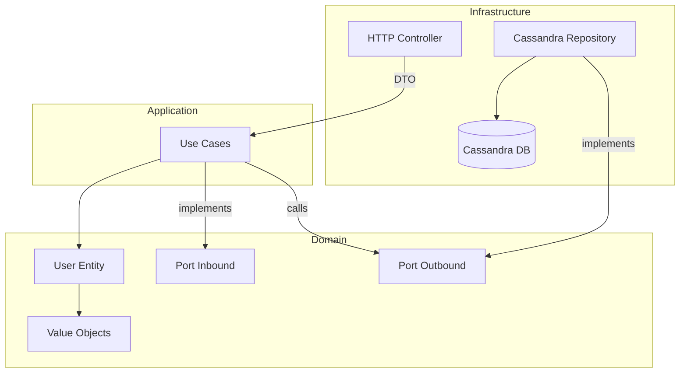
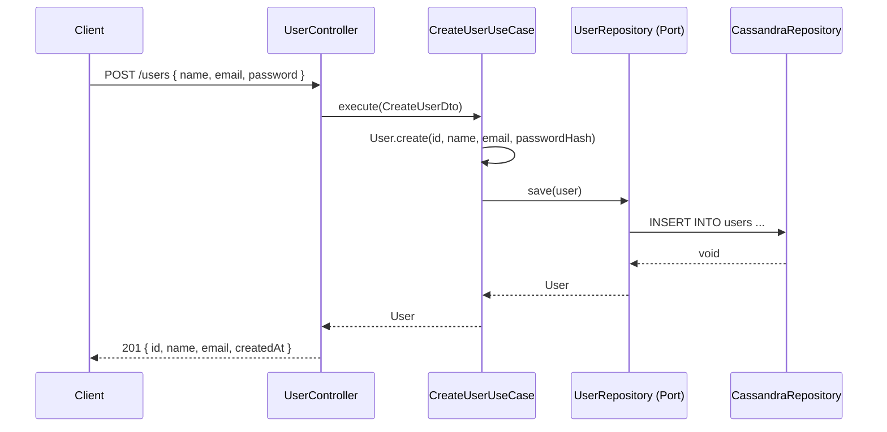
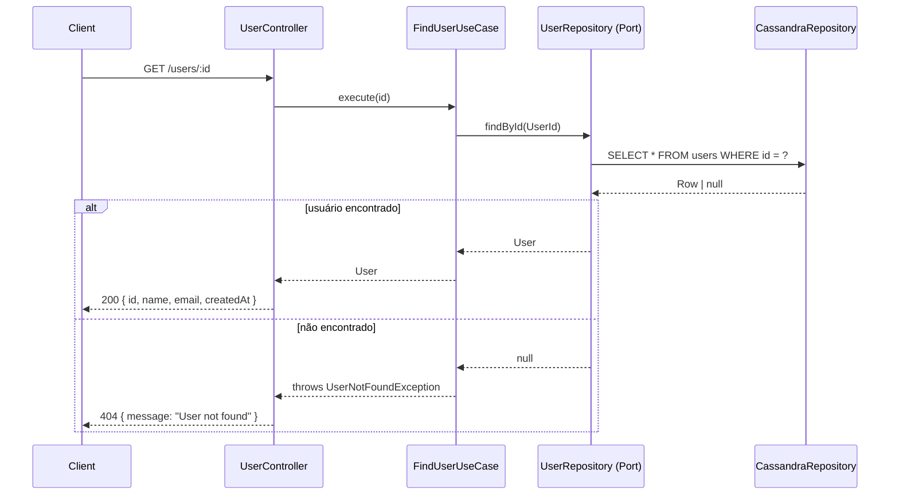

# Design Document: User Management

## Overview

Módulo de gerenciamento de usuários construído sobre arquitetura hexagonal (Ports & Adapters) dentro de um monolito modular NestJS 11. O domínio de usuário é completamente isolado de detalhes de infraestrutura, com Cassandra como banco de dados primário via `cassandra-driver`.

O módulo expõe operações CRUD completas (criar, buscar por ID, listar, atualizar, deletar) através de uma API REST, mantendo o domínio agnóstico a frameworks e bancos de dados.

A estrutura modular garante que cada bounded context (módulo NestJS) seja auto-contido, com suas próprias camadas de domínio, aplicação e infraestrutura, permitindo evolução independente sem acoplamento entre módulos.

---

## Architecture

### Estrutura de Pastas

```
src/
├── app.module.ts
├── main.ts
└── modules/
    └── user/
        ├── user.module.ts
        ├── domain/
        │   ├── entities/
        │   │   └── user.entity.ts
        │   ├── value-objects/
        │   │   ├── user-id.vo.ts
        │   │   └── email.vo.ts
        │   ├── ports/
        │   │   ├── inbound/
        │   │   │   └── user-use-cases.port.ts
        │   │   └── outbound/
        │   │       └── user-repository.port.ts
        │   └── exceptions/
        │       └── user-not-found.exception.ts
        ├── application/
        │   └── use-cases/
        │       ├── create-user.use-case.ts
        │       ├── find-user.use-case.ts
        │       ├── list-users.use-case.ts
        │       ├── update-user.use-case.ts
        │       └── delete-user.use-case.ts
        └── infrastructure/
            ├── http/
            │   ├── user.controller.ts
            │   └── dto/
            │       ├── create-user.dto.ts
            │       └── update-user.dto.ts
            └── persistence/
                ├── cassandra/
                │   ├── cassandra.module.ts
                │   ├── cassandra.provider.ts
                │   └── user-cassandra.repository.ts
                └── mappers/
                    └── user-cassandra.mapper.ts
```

### Diagrama de Camadas



---

## Sequence Diagrams

### Criar Usuário



### Buscar Usuário por ID



---

## Components and Interfaces

### Domain: User Entity

**Purpose**: Representa o agregado raiz do domínio de usuário, encapsulando regras de negócio e invariantes.

**Interface**:
```typescript
interface UserProps {
  id: UserId
  name: string
  email: Email
  passwordHash: string
  createdAt: Date
  updatedAt: Date
}

class User {
  static create(props: Omit<UserProps, 'createdAt' | 'updatedAt'>): User
  static reconstitute(props: UserProps): User

  get id(): UserId
  get name(): string
  get email(): Email
  get passwordHash(): string
  get createdAt(): Date
  get updatedAt(): Date

  updateName(name: string): void
  updateEmail(email: Email): void
}
```

**Responsabilidades**:
- Garantir invariantes do domínio (nome não vazio, email válido)
- Encapsular lógica de criação e reconstituição
- Imutabilidade via getters

---

### Domain: Value Objects

**UserId**:
```typescript
class UserId {
  constructor(value: string)  // UUID v4
  get value(): string
  equals(other: UserId): boolean
  static generate(): UserId
}
```

**Email**:
```typescript
class Email {
  constructor(value: string)  // valida formato RFC 5322
  get value(): string
  equals(other: Email): boolean
}
```

---

### Domain: Ports (Inbound)

**Purpose**: Contrato que os use cases implementam — define o que a camada HTTP pode chamar.

```typescript
// domain/ports/inbound/user-use-cases.port.ts
interface ICreateUserUseCase {
  execute(dto: CreateUserDto): Promise<User>
}

interface IFindUserUseCase {
  execute(id: string): Promise<User>
}

interface IListUsersUseCase {
  execute(): Promise<User[]>
}

interface IUpdateUserUseCase {
  execute(id: string, dto: UpdateUserDto): Promise<User>
}

interface IDeleteUserUseCase {
  execute(id: string): Promise<void>
}
```

---

### Domain: Ports (Outbound)

**Purpose**: Contrato que o repositório implementa — define o que os use cases podem persistir/consultar.

```typescript
// domain/ports/outbound/user-repository.port.ts
interface IUserRepository {
  save(user: User): Promise<void>
  findById(id: UserId): Promise<User | null>
  findByEmail(email: Email): Promise<User | null>
  findAll(): Promise<User[]>
  update(user: User): Promise<void>
  delete(id: UserId): Promise<void>
}
```

---

### Application: Use Cases

**Purpose**: Orquestram o fluxo de negócio, coordenando entidades e ports outbound.

**Tokens de injeção (NestJS)**:
```typescript
export const USER_REPOSITORY = Symbol('IUserRepository')
export const CREATE_USER_USE_CASE = Symbol('ICreateUserUseCase')
export const FIND_USER_USE_CASE = Symbol('IFindUserUseCase')
export const LIST_USERS_USE_CASE = Symbol('IListUsersUseCase')
export const UPDATE_USER_USE_CASE = Symbol('IUpdateUserUseCase')
export const DELETE_USER_USE_CASE = Symbol('IDeleteUserUseCase')
```

---

### Infrastructure: UserController

**Purpose**: Adapter HTTP que traduz requisições REST para chamadas de use cases.

```typescript
@Controller('users')
class UserController {
  constructor(
    @Inject(CREATE_USER_USE_CASE) private createUser: ICreateUserUseCase,
    @Inject(FIND_USER_USE_CASE)   private findUser: IFindUserUseCase,
    @Inject(LIST_USERS_USE_CASE)  private listUsers: IListUsersUseCase,
    @Inject(UPDATE_USER_USE_CASE) private updateUser: IUpdateUserUseCase,
    @Inject(DELETE_USER_USE_CASE) private deleteUser: IDeleteUserUseCase,
  ) {}

  @Post()   create(@Body() dto: CreateUserDto): Promise<UserResponseDto>
  @Get()    findAll(): Promise<UserResponseDto[]>
  @Get(':id') findOne(@Param('id') id: string): Promise<UserResponseDto>
  @Patch(':id') update(@Param('id') id: string, @Body() dto: UpdateUserDto): Promise<UserResponseDto>
  @Delete(':id') remove(@Param('id') id: string): Promise<void>
}
```

---

### Infrastructure: CassandraRepository

**Purpose**: Adapter de persistência que implementa `IUserRepository` usando `cassandra-driver`.

```typescript
class UserCassandraRepository implements IUserRepository {
  constructor(private readonly client: Client) {}

  save(user: User): Promise<void>
  findById(id: UserId): Promise<User | null>
  findByEmail(email: Email): Promise<User | null>
  findAll(): Promise<User[]>
  update(user: User): Promise<void>
  delete(id: UserId): Promise<void>
}
```

---

## Data Models

### Cassandra Schema

```sql
CREATE KEYSPACE IF NOT EXISTS app
  WITH replication = {'class': 'SimpleStrategy', 'replication_factor': 1};

USE app;

-- Tabela principal: lookup por ID (partition key = id)
CREATE TABLE IF NOT EXISTS users (
  id        UUID,
  name      TEXT,
  email     TEXT,
  password_hash TEXT,
  created_at TIMESTAMP,
  updated_at TIMESTAMP,
  PRIMARY KEY (id)
);

-- Tabela auxiliar: lookup por email (necessário para unicidade)
CREATE TABLE IF NOT EXISTS users_by_email (
  email     TEXT,
  id        UUID,
  PRIMARY KEY (email)
);
```

**Regras de validação**:
- `id`: UUID v4, gerado na camada de domínio
- `name`: não vazio, máximo 255 caracteres
- `email`: formato válido RFC 5322, único no sistema
- `password_hash`: bcrypt hash, nunca armazenado em plain text
- `created_at` / `updated_at`: gerados automaticamente

### Mapper: CassandraRow → User Entity

```typescript
class UserCassandraMapper {
  static toDomain(row: types.Row): User
  static toPersistence(user: User): Record<string, unknown>
}
```

---

## Key Functions with Formal Specifications

### CreateUserUseCase.execute()

```typescript
async execute(dto: CreateUserDto): Promise<User>
```

**Preconditions:**
- `dto.name` é string não vazia
- `dto.email` é email válido
- `dto.password` tem mínimo 8 caracteres
- Não existe usuário com `dto.email` no repositório

**Postconditions:**
- Retorna `User` com `id` gerado (UUID v4)
- `user.passwordHash` é hash bcrypt do `dto.password`
- Usuário persiste em `users` e `users_by_email`
- `createdAt` e `updatedAt` são iguais no momento da criação

**Loop Invariants:** N/A

---

### FindUserUseCase.execute()

```typescript
async execute(id: string): Promise<User>
```

**Preconditions:**
- `id` é string no formato UUID v4

**Postconditions:**
- Se usuário existe: retorna `User` com todos os campos populados
- Se não existe: lança `UserNotFoundException` (HTTP 404)

**Loop Invariants:** N/A

---

### UpdateUserUseCase.execute()

```typescript
async execute(id: string, dto: UpdateUserDto): Promise<User>
```

**Preconditions:**
- `id` é UUID v4 de usuário existente
- `dto` contém ao menos um campo (`name` ou `email`)
- Se `dto.email` presente: não existe outro usuário com esse email

**Postconditions:**
- Retorna `User` com campos atualizados
- `updatedAt` é posterior ao `updatedAt` anterior
- Campos não presentes no `dto` permanecem inalterados

**Loop Invariants:** N/A

---

## Algorithmic Pseudocode

### Algoritmo: CreateUser

```pascal
ALGORITHM CreateUser(dto)
INPUT: dto { name: String, email: String, password: String }
OUTPUT: user of type User

BEGIN
  ASSERT dto.name IS NOT EMPTY
  ASSERT dto.email IS VALID EMAIL FORMAT
  ASSERT dto.password LENGTH >= 8

  existing ← repository.findByEmail(Email(dto.email))
  IF existing IS NOT NULL THEN
    THROW ConflictException("Email already in use")
  END IF

  id       ← UserId.generate()
  hash     ← bcrypt.hash(dto.password, 10)
  now      ← DateTime.now()

  user ← User.create({
    id:           id,
    name:         dto.name,
    email:        Email(dto.email),
    passwordHash: hash,
    createdAt:    now,
    updatedAt:    now
  })

  repository.save(user)

  ASSERT user.id IS NOT NULL
  ASSERT user.createdAt EQUALS user.updatedAt

  RETURN user
END
```

---

### Algoritmo: UpdateUser

```pascal
ALGORITHM UpdateUser(id, dto)
INPUT: id: String (UUID), dto { name?: String, email?: String }
OUTPUT: user of type User

BEGIN
  ASSERT id IS VALID UUID
  ASSERT dto HAS AT LEAST ONE FIELD

  user ← repository.findById(UserId(id))
  IF user IS NULL THEN
    THROW UserNotFoundException(id)
  END IF

  IF dto.name IS PRESENT THEN
    ASSERT dto.name IS NOT EMPTY
    user.updateName(dto.name)
  END IF

  IF dto.email IS PRESENT THEN
    ASSERT dto.email IS VALID EMAIL FORMAT
    conflict ← repository.findByEmail(Email(dto.email))
    IF conflict IS NOT NULL AND conflict.id NOT EQUALS user.id THEN
      THROW ConflictException("Email already in use")
    END IF
    user.updateEmail(Email(dto.email))
  END IF

  repository.update(user)

  ASSERT user.updatedAt > previousUpdatedAt

  RETURN user
END
```

---

## Error Handling

### UserNotFoundException

**Condition**: `findById` ou `findByEmail` retorna `null`
**Response**: HTTP 404 com `{ message: "User not found", id }`
**Recovery**: Cliente deve verificar o ID antes de chamar

### EmailConflictException

**Condition**: Tentativa de criar/atualizar com email já existente
**Response**: HTTP 409 com `{ message: "Email already in use" }`
**Recovery**: Cliente deve usar email diferente

### ValidationException

**Condition**: DTO inválido (email malformado, senha curta, nome vazio)
**Response**: HTTP 400 com array de erros de validação
**Recovery**: Cliente corrige os campos inválidos

### CassandraConnectionException

**Condition**: `cassandra-driver` falha ao conectar ou executar query
**Response**: HTTP 500 com `{ message: "Internal server error" }`
**Recovery**: Retry automático via `cassandra-driver` policies; log para observabilidade

---

## Testing Strategy

### Unit Testing

Cada use case é testado isoladamente com repositório mockado:

```typescript
// create-user.use-case.spec.ts
describe('CreateUserUseCase', () => {
  it('should create user with hashed password')
  it('should throw ConflictException when email exists')
  it('should throw ValidationException for invalid email')
})
```

### Property-Based Testing

**Property Test Library**: `fast-check`

Propriedades a verificar:
- Para qualquer email válido, `Email.create(email).value` preserva o valor original
- Para qualquer `User` criado, `createdAt <= updatedAt` sempre
- `UserId.generate()` sempre produz UUIDs únicos em sequência

### Integration Testing

Testes com Cassandra real (via Docker) para validar:
- Persistência e reconstituição de `User` via `UserCassandraRepository`
- Unicidade de email via `users_by_email`
- Comportamento de `findAll` com múltiplos registros

---

## Performance Considerations

- Cassandra é otimizado para leituras por partition key (`id`). `findById` é O(1).
- `findAll` sem paginação pode ser custoso em produção — considerar cursor-based pagination.
- `users_by_email` é uma denormalização intencional para lookup eficiente por email sem ALLOW FILTERING.
- Prepared statements via `cassandra-driver` para todas as queries (evita re-parse).

---

## Security Considerations

- Senhas nunca armazenadas em plain text — sempre bcrypt com salt rounds >= 10.
- `passwordHash` nunca exposto em responses HTTP (mapeado para `UserResponseDto` sem o campo).
- Validação de input na camada HTTP (DTOs com class-validator) antes de chegar nos use cases.
- UUIDs gerados no domínio — não aceitar IDs fornecidos pelo cliente.

---

## Dependencies

| Pacote | Uso |
|---|---|
| `cassandra-driver` | Client Cassandra (já instalado) |
| `uuid` | Geração de UUID v4 para `UserId` |
| `bcrypt` | Hash de senhas |
| `class-validator` | Validação de DTOs |
| `class-transformer` | Serialização/deserialização de DTOs |
| `@nestjs/mapped-types` | `PartialType` para `UpdateUserDto` |

---

## Correctness Properties

*A property is a characteristic or behavior that should hold true across all valid executions of a system — essentially, a formal statement about what the system should do. Properties serve as the bridge between human-readable specifications and machine-verifiable correctness guarantees.*

### Property 1: Email value object preserves valid input

*For any* valid RFC 5322 email string, constructing `Email(str)` and reading `.value` should return the original string unchanged.

**Validates: Requirements 6.2**

---

### Property 2: Email value object rejects invalid input

*For any* string that does not conform to RFC 5322 email format, constructing `Email(str)` should throw a domain exception.

**Validates: Requirements 6.1**

---

### Property 3: UserId generation produces unique UUID v4 values

*For any* sequence of `UserId.generate()` calls, each resulting value should match the UUID v4 format and no two generated values should be equal.

**Validates: Requirements 1.2, 6.3**

---

### Property 4: User creation invariant — createdAt equals updatedAt

*For any* valid set of user creation inputs, the resulting `User` entity should have `createdAt` strictly equal to `updatedAt`.

**Validates: Requirements 1.4, 6.4**

---

### Property 5: User update advances updatedAt

*For any* existing `User` entity, calling `updateName()` or `updateEmail()` should result in `updatedAt` being greater than or equal to the previous `updatedAt` value.

**Validates: Requirements 4.2, 6.5**

---

### Property 6: Partial update preserves unspecified fields

*For any* existing user and any partial update DTO containing only a subset of fields, the fields not present in the DTO should remain identical to their pre-update values after the update is applied.

**Validates: Requirements 4.3**

---

### Property 7: Mapper round-trip

*For any* valid `User` entity, mapping it to a Cassandra persistence record via `UserCassandraMapper.toPersistence()` and then back via `toDomain()` should produce a `User` entity equivalent to the original.

**Validates: Requirements 7.6**

---

### Property 8: Persistence round-trip by ID

*For any* valid `User` saved via `UserRepository.save()`, calling `UserRepository.findById()` with the same `UserId` should return a `User` entity with all fields equivalent to the saved entity.

**Validates: Requirements 7.1, 7.2**

---

### Property 9: Persistence round-trip by email

*For any* valid `User` saved via `UserRepository.save()`, calling `UserRepository.findByEmail()` with the same `Email` should return a `User` entity with all fields equivalent to the saved entity.

**Validates: Requirements 7.1, 7.4**

---

### Property 10: Password is never stored as plain text

*For any* password string provided during user creation, the value stored in the repository should not equal the original plain text string, and should be verifiable as a valid bcrypt hash with cost factor >= 10.

**Validates: Requirements 1.3, 8.2, 8.3**

---

### Property 11: passwordHash is never exposed in HTTP responses

*For any* HTTP response returned by the System (create, find, list, update), the response body should not contain a `passwordHash` field.

**Validates: Requirements 2.3, 3.3, 8.1**

---

### Property 12: Invalid creation inputs are rejected

*For any* user creation DTO where `name` is empty/whitespace, `email` is not valid RFC 5322, or `password` has fewer than 8 characters, the System should return HTTP 400 and not persist any data.

**Validates: Requirements 1.6, 1.7, 1.8**

---

### Property 13: Delete removes user from all lookups

*For any* existing `User` that is deleted via `UserRepository.delete()`, subsequent calls to `findById()` and `findByEmail()` with that user's identifiers should both return `null`.

**Validates: Requirements 5.1**
